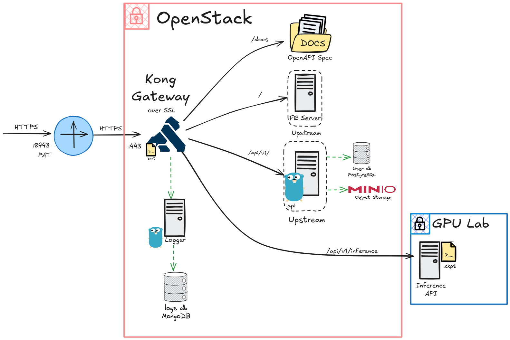

# numberfy

by Cloud Controllers (CCs) 

_Junio del 2025._

Repositorio de assessment final del equipo 1. 

Alumnos:
- **Alejandro Arouesty** - A01782691
- **Andrés Tarazona** - A01023332
- **Joaquín Badillo** - A01026364
- **Rodrigo Núñez** - A01028310

## Descripción breve del proyecto

_numberfy_ es una aplicación web que permite al usuario dibujar números del 0 al 9 en una cuadrícula de 112x112 pixeles, y obetener una inferencia de qué números se dibujaron, por un modelo de Inteligencia Artificial de Segmentación Semántica. El usuario debe registrarse con un identificador y una contraseña, para poder guardar su historial de inferencias, además de proteger las sesiones del usuario y el uso de los activos tecnológicos del proyecto, limitando estos al uso exclusivo de usuarios registrados en la aplicación.

## Arquitectura

### Vista de Desarrollador

### Descripción de la arquitectura
Toda la arquitectura de este proyecto fue desplegada en la nube privada ubicada en el Hub de Ciberseguridad del Tecnológico de Monterrey Campus Santa Fe. Para empezar, el punto de entrada y de salida para todo lo relacionado con la aplicación es un API Gateway implementado con Kong, que es un API Gateway de código abierto. Se decidió hacer esto por cuestiones de seguridad, para facilitar el enrutamiento interno de peticiones, y para poder registrar todas las peticiones que entraran a y salieran de la aplicación.

Este regisro se realizó con ayuda de un plugin nativo de Kong llamado HTTPLog, el cual recibe un endpoint en donde va a realizar una solicitud POST con las peticiones http que tenga el Gateway. Para manejar esto, utilizamos un API pequeño escrito en Go, conectado directamente a una base de datos MongoDB para almacenar los registros de las peticiones, como se observa en el diagrama.

Adicionalmente, tanto el front-end como el back-end fueron replicados en dos instancias de cómputo, para que Kong pudiera hacer balanceo de cargas de las peticiones, utilizando el algoritmo de Round Robin. El front-end de la aplicación fue desarrollado con React, y el back-end consiste en dos partes principales: 

- Un API escrito también en Go que maneja todo lo relacionado con la autenticación de los usuarios y de la aplicación, que fue implementando siguiendo las reglas del estándar de OAuth2, y que también maneja la lógica de conexión con tanto una base de datos PostgreSQL que almacena la información de los usuarios y las inferencias que realizan a través de la aplicación, así como un almacenamiento de objetos llamado MinIO para guardar los archivos de las imágenes como tal.

- Otro API, escrito en Python, que contiene el modelo de IA utilizado en el proyecto y al cual se le solicita la inferencia a partir de un dibujo del usuario. El modelo se carga desde un archivo de _checkpoint_, ya entrenado, y se le solicita una inferencia cuando viene una petición hacia el endpoint correspondiente del API. Cabe mencionar que este despliegue es el único que no se realizó en una de las máquinas virtuales de la nube, sino en una máquina física que tiene GPU, ubicada en el laboratorio al lado del Hub.

Finalmente, se tuvieron 7 máquinas virtuales para los despliegues, como sigue:

- KONG Gateway
- Logger y MongoDB: API que registra las peticiones a KONG
- Front End 1 (Balanceo)
- Front End 2 (Balanceo)
- Back End 1 (Balanceo)
- Back End 2 (Balanceo)
- DB: PostgreSQL y MinIO

## Redes

## Pruebas realizadas